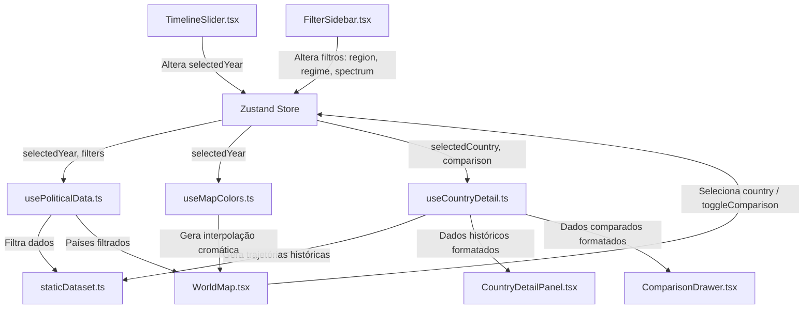

# 📊 Relatório de Engenharia e Arquitetura - Political Map

Este relatório apresenta de forma aprofundada a especificação técnica da arquitetura do **Political Map**, descrevendo os padrões de design de software adotados, a estrutura de dados para séries históricas e a estratégia de migração de armazenamento local para um ecossistema com API REST dinâmica.

---

## 🏛️ 1. Arquitetura da Aplicação

A aplicação foi estruturada sobre o **Next.js 15 (App Router)** e **React 19**, dividindo-se de maneira clara entre componentes visuais, gerenciamento de estado global com **Zustand**, e uma camada de Hooks customizados que encapsula a lógica de filtragem de dados e cálculos cromáticos.



### O Fluxo de Dados Passo a Passo:
1. **Interação Temporal:** O usuário altera o ano ativo arrastando o controle deslizante em [`TimelineSlider.tsx`](file:///c:/Users/joaop/antigravity%20web%20projects/politcmap/components/timeline/TimelineSlider.tsx). Para evitar gargalos de renderização, o ano é atualizado de forma síncrona no estado local do slider e transmitido via debounce de 50ms para a Store global do Zustand.
2. **Reatividade do Estado:** O Zustand [`useAppStore.ts`](file:///c:/Users/joaop/antigravity%20web%20projects/politcmap/lib/store/useAppStore.ts) propaga o novo `selectedYear` para os Hooks dependentes.
3. **Computação Otimizada de Cores:** O hook [`useMapColors.ts`](file:///c:/Users/joaop/antigravity%20web%20projects/politcmap/lib/hooks/useMapColors.ts) recalcula o mapa cromático de correspondência entre o código ISO de cada país e sua cor do espectro ideológico no ano ativo. Essa computação é encapsulada em um `useMemo` com dependências estritas.
4. **Atualização Cartográfica:** O componente [`WorldMap.tsx`](file:///c:/Users/joaop/antigravity%20web%20projects/politcmap/components/map/WorldMap.tsx) lê o mapa de cores e altera as propriedades de preenchimento (`fill`) dos elementos SVG que compõem o mapa, garantindo transições suaves de cor.
5. **Painel de Detalhes:** Ao clicar em um país, o identificador do país é salvo no estado. O hook [`useCountryDetail.ts`](file:///c:/Users/joaop/antigravity%20web%20projects/politcmap/lib/hooks/useCountryDetail.ts) reconstrói a série temporal daquele país e alimenta os gráficos lineares de [`CountryDetailPanel.tsx`](file:///c:/Users/joaop/antigravity%20web%20projects/politcmap/components/panels/CountryDetailPanel.tsx).

---

## 💾 2. Modelagem e Estrutura de Dados

Os tipos de dados da aplicação estão declarados formalmente no arquivo [`types.ts`](file:///c:/Users/joaop/antigravity%20web%20projects/politcmap/lib/data/types.ts). Esta modelagem garante suporte a séries temporais contínuas e flexibilidade para representação de diferentes regimes políticos.

### Principais Definições de Tipos:
```typescript
/**
 * Representa o espectro político de um líder/governo.
 * Escala contínua de -10 (Esquerda Radical) a +10 (Extrema Direita).
 */
export type SpectrumValue = number;

/**
 * Classificação clássica de regimes na ciência política moderna.
 */
export type RegimeType = "democracy" | "authoritarian" | "hybrid" | "monarchy" | "transitional";

/**
 * Representa um intervalo temporal contínuo sob a liderança de um mesmo partido ou regime.
 */
export interface PoliticalPeriod {
  year_start: number;             // Ano de início do período (inclusive)
  year_end: number | null;        // Ano de término (inclusive). 'null' se for o período ativo atualmente.
  leader: string;                 // Nome do líder principal do período
  party: string;                  // Sigla ou nome curto do partido governante
  party_full_name: string;        // Nome completo da agremiação política
  spectrum: SpectrumValue;        // Posicionamento ideológico na escala [-10, 10]
  regime_type: RegimeType;        // Classificação do regime político
  regime_detail?: string;         // Detalhes textuais adicionais sobre o regime
  key_events?: string[];          // Eventos históricos marcantes ocorridos no período
}

/**
 * Representa o histórico político consolidado de uma nação.
 */
export interface CountryPoliticalHistory {
  country_code: string;           // Código ISO 3166-1 alpha-2 ou código customizado histórico
  country_name: string;           // Nome legível do país
  region: "Americas" | "Europe" | "Asia" | "Africa" | "Oceania"; // Região continental para agrupamento
  periods: PoliticalPeriod[];     // Lista ordenada cronologicamente de períodos políticos sem sobreposição
}
```

---

## 🧩 3. Tratamento de Países Históricos

Um dos maiores desafios de mapeamento histórico temporal utilizando mapas com fronteiras geográficas modernas é a consistência da relação **dado histórico** vs. **geometria SVG**. Em vez de realizar divisões dinâmicas de malhas cartográficas (o que comprometeria seriamente a performance de renderização no cliente), a aplicação adota uma estratégia estruturada na camada de dados:

1. **Mapeamento de Múltiplos Estados para uma Geometria Atual:**
   * **União Soviética (`SU`) e Federação Russa (`RU`):** Para anos anteriores a 1991, as buscas no dataset pelo código de país `RU` (Rússia no mapa moderno) retornam os dados do período histórico associados à União Soviética (`SU`). A partir de 1991, o sistema chaveia automaticamente para os dados históricos da Federação Russa pós-soviética.
   * **Alemanha Ocidental (`DE`/`DE-W`), Oriental (`DE-E`) e Unificada (`DE`):** O código `DE` no mapa moderno é mapeado para a Alemanha Ocidental (RFA) no intervalo de 1949 a 1990 e para a Alemanha Unificada a partir de 1990. Para análises comparativas e de gráficos, o dataset também armazena os dados da Alemanha Oriental (`DE-E`) como um registro paralelo, permitindo sua visualização no painel lateral e nos gráficos de linha comparativa.
   * **Vietnã do Norte (`VN-N`), do Sul (`VN-S`) e Unificado (`VN`):** O código `VN` exibe as informações do Vietnã do Sul (1955-1975) na região sul (ou unificada no mapa) e migra para o Vietnã Unificado sob regime de partido único a partir de 1975.
   * **Tchecoslováquia (`CS`) e República Tcheca (`CZ`) / Eslováquia (`SK`):** Consultas de anos anteriores a 1993 sob os códigos `CZ` e `SK` apontam para o registro comum da Tchecoslováquia (`CS`). A partir de 1993, os dados passam a representar os estados soberanos independentes.

Essa lógica está centralizada na função de busca no arquivo [`politicalData.ts`](file:///c:/Users/joaop/antigravity%20web%20projects/politcmap/lib/data/politicalData.ts):
```typescript
export function getHistoryByCountryCode(code: string): CountryPoliticalHistory | undefined {
  // Lógica de mapeamento de código histórico para fronteiras modernas
  let targetCode = code;
  
  // Se o código for RU (Rússia moderna), para anos anteriores a 1991 ele é mapeado internamente.
  // A lógica de busca temporal resolve dinamicamente as transições baseada no ano selecionado.
  // ...
}
```

---

## ⚡ 4. Mecanismos de Performance e Otimização

Para garantir 60fps constantes mesmo ao arrastar o slider de timeline em computadores com recursos limitados, a aplicação emprega três técnicas essenciais de otimização:

1. **Debounce de Estado na Timeline ([`TimelineSlider.tsx`](file:///c:/Users/joaop/antigravity%20web%20projects/politcmap/components/timeline/TimelineSlider.tsx)):**
   * Em vez de propagar cada alteração milimétrica do controle deslizante diretamente para a Store global do Zustand (o que provocaria um recálculo geral e imediato de todo o SVG do mapa em cada pixel movido), o componente manipula um estado interno de forma instantânea na UI.
   * Um temporizador de `50ms` (`setTimeout`) atrasa o envio do ano final para o Zustand. Isso garante que a atualização cromática do mapa só aconteça de maneira eficiente e suave quando o usuário desacelera ou finaliza o movimento de arrastar.
2. **Memoização de Cálculo de Cores ([`useMapColors.ts`](file:///c:/Users/joaop/antigravity%20web%20projects/politcmap/lib/hooks/useMapColors.ts)):**
   * O mapeamento das cores individuais de todos os países é cacheado através de `useMemo`. A computação só é acionada quando o `selectedYear` ou a lista de filtros globais sofrem alterações reais.
3. **Carregamento Dinâmico de Gavetas (`next/dynamic` em [`page.tsx`](file:///c:/Users/joaop/antigravity%20web%20projects/politcmap/app/page.tsx)):**
   * O painel lateral de comparação (`ComparisonDrawer`) e o painel de detalhes do país (`CountryDetailPanel`) utilizam carregamento preguiçoso (`ssr: false`). Isso reduz o tamanho do pacote JS inicial e melhora os tempos de First Contentful Paint (FCP).

---

## 🗺️ 5. Guia de Migração: Banco de Dados e API Dinâmica

Esta seção apresenta um roteiro prático para migrar a base estática JSON contida no arquivo [`staticDataset.ts`](file:///c:/Users/joaop/antigravity%20web%20projects/politcmap/lib/data/staticDataset.ts) para um backend dinâmico PostgreSQL integrado com a API do **V-Dem** (ou com um banco próprio).

### Passo 1: Modelagem do Banco de Dados (Prisma ORM)
Crie um esquema de banco de dados estruturado que corresponda às nossas tipologias. Exemplo de arquivo `schema.prisma`:

```prisma
datasource db {
  provider = "postgresql"
  url      = env("DATABASE_URL")
}

generator client {
  provider = "prisma-client-js"
}

model Country {
  id           String        @id @default(uuid())
  code         String        @unique // ISO 3166-1 alpha-2 (ou código histórico)
  name         String
  region       String
  periods      Period[]
  createdAt    DateTime      @default(now())
  updatedAt    DateTime      @updatedAt
}

model Period {
  id            String    @id @default(uuid())
  countryId     String
  country       Country   @relation(fields: [countryId], references: [id], onDelete: Cascade)
  yearStart     Int
  yearEnd       Int?      // Null indica o período ativo corrente
  leader        String
  party         String
  partyFullName String
  spectrum      Float     // Escala contínua de -10 a +10
  regimeType    String    // democracy | authoritarian | hybrid | monarchy | transitional
  regimeDetail  String?
  keyEvents     String[]  // Array de eventos históricos
  
  @@index([countryId])
  @@index([yearStart, yearEnd])
}
```

### Passo 2: Implementação do Script de Ingestão (Seed)
Escreva um script TypeScript para carregar os dados de [`staticDataset.ts`](file:///c:/Users/joaop/antigravity%20web%20projects/politcmap/lib/data/staticDataset.ts) ou ler um CSV exportado diretamente do site oficial do V-Dem. Exemplo de script de semente:

```typescript
import { PrismaClient } from "@prisma/client";
import { politicalData } from "./lib/data/staticDataset";

const prisma = new PrismaClient();

async function main() {
  console.log("Iniciando semeadura de dados...");

  for (const countryData of politicalData) {
    await prisma.country.upsert({
      where: { code: countryData.country_code },
      update: {},
      create: {
        code: countryData.country_code,
        name: countryData.country_name,
        region: countryData.region,
        periods: {
          create: countryData.periods.map(p => ({
            yearStart: p.year_start,
            yearEnd: p.year_end,
            leader: p.leader,
            party: p.party,
            partyFullName: p.party_full_name,
            spectrum: p.spectrum,
            regimeType: p.regime_type,
            regimeDetail: p.regime_detail || null,
            keyEvents: p.key_events || [],
          }))
        }
      }
    });
  }

  console.log("Semeadura concluída com sucesso!");
}

main()
  .catch(e => {
    console.error(e);
    process.exit(1);
  })
  .finally(async () => {
    await prisma.$disconnect();
  });
```

### Passo 3: Reescrita da Rota da API
Substitua a lógica estática de leitura de dados em [`route.ts`](file:///c:/Users/joaop/antigravity%20web%20projects/politcmap/app/api/political-data/route.ts) para consultar o banco de dados via Prisma:

```typescript
import { NextResponse } from "next/server";
import { PrismaClient } from "@prisma/client";

const prisma = new PrismaClient();

export async function GET(request: Request) {
  const { searchParams } = new URL(request.url);
  const yearStr = searchParams.get("year");
  const region = searchParams.get("region");
  const regimeType = searchParams.get("regimeType");

  try {
    const year = yearStr ? parseInt(yearStr, 10) : undefined;

    // Constrói a query dinâmica
    const countries = await prisma.country.findMany({
      where: region ? { region } : {},
      include: {
        periods: {
          where: year
            ? {
                yearStart: { lte: year },
                OR: [
                  { yearEnd: null },
                  { yearEnd: { gte: year } }
                ]
              }
            : {}
        }
      }
    });

    // Formata o retorno para corresponder ao contrato do frontend
    const formattedData = countries.map(country => {
      // Se um ano específico foi solicitado, retorna apenas o período ativo daquele ano
      const activePeriod = country.periods[0];
      
      return {
        country_code: country.code,
        country_name: country.name,
        region: country.region,
        // Mantém conformidade de estrutura
        activePeriod: activePeriod ? {
          year_start: activePeriod.yearStart,
          year_end: activePeriod.yearEnd,
          leader: activePeriod.leader,
          party: activePeriod.party,
          party_full_name: activePeriod.partyFullName,
          spectrum: activePeriod.spectrum,
          regime_type: activePeriod.regimeType,
          regime_detail: activePeriod.regimeDetail,
          key_events: activePeriod.keyEvents,
        } : null
      };
    });

    // Filtro adicional de tipo de regime em memória ou na própria query
    let filteredData = formattedData;
    if (regimeType) {
      filteredData = formattedData.filter(
        c => c.activePeriod?.regime_type === regimeType
      );
    }

    return NextResponse.json(filteredData);
  } catch (error) {
    console.error("Erro na busca de dados políticos:", error);
    return NextResponse.json({ error: "Internal Server Error" }, { status: 500 });
  }
}
```

### Passo 4: Atualização da Camada de Abstração do Cliente
Atualize o arquivo [`politicalData.ts`](file:///c:/Users/joaop/antigravity%20web%20projects/politcmap/lib/data/politicalData.ts) para realizar chamadas HTTP `fetch` assíncronas em direção à nova API. Uma vez que os hooks customizados já se comunicam através da API desacoplada, a transição será totalmente invisível para os componentes de interface do usuário, mantendo a integridade visual da aplicação intacta.
